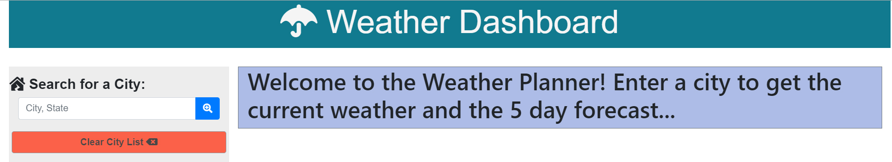
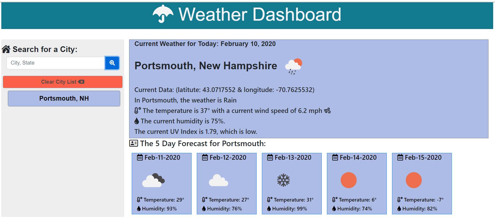

# Weather Dashboard

Using multiple APIs, the current weather and 5 day forecasts are available for any city inputed by the user.. 

## Premise

Weather APIs are full of useful information, and weather APIs are vital for getting up to the minute info for users.

### Site repository (public)

* [Github Repository]( https://github.com/whoerman/Work-Day-Planner) -  https://github.com/whoerman/Work-Day-Planner
* [Github Page]( https://whoerman.github.io/Work-Day-Planner/) -  https://whoerman.github.io/Work-Day-Planner/

This program runs the html/css/js right on github, and all css and js references are dynamic to websites.

### Prerequisites

This program runs the html/css/js right on github, and all css and js references are dynamic to websites.

## Built With

* [VSCode](https://code.visualstudio.com/) - Editor

## APIs used for data

* [OpenCage](https://opencagedata.com/) - Source to convert city name to latitude and longitude

* [OpenWeatherMap](hhttps://openweathermap.org/) - Source of weaahter information

## Reference Libraries

* [Bootstrap](https://getbootstrap.com/) - Dynamic Front-end Framework library with cross-browser capabilities

* [Font Awesome](https://fontawesome.com/) - vector icons

* [Google Fonts](https://fonts.google.com/) - font library

* [Moment JS](https://momentjs.com/) - dynamic timing

### Use Explanation



When opened, the user is asked for a city, unless previous has been stored in local storage, when the last enetered city will be processed and all the previous cities.

All of the data is filled in dynamically with DOM manipulation through javascript.

When the page is loaded, the weather parameters are filled in for the page. The latest data is stored in local storage for refilling on refreshing the page.
.
```
```
### Acknowledgements

Written by walter Hoerman as part of the coursework for the UNH Full Stack Web Development Bootcamp.

